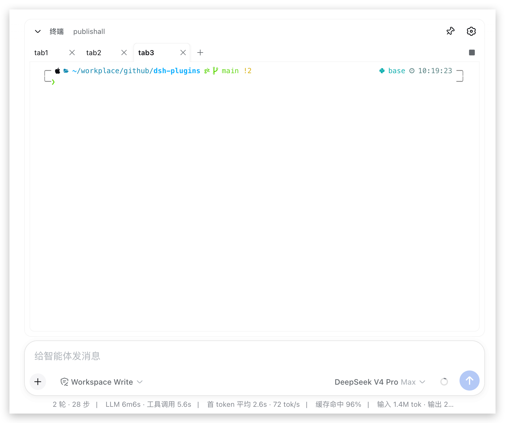
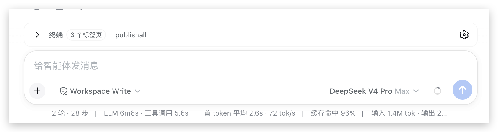

> 🌐 语言 / Language：**中文** | [English](README.en.md)

# dsh-terminal

在 DeepSeek Harness Web 会话里内嵌一个**可折叠的交互式终端**：每个 tab 都是一个跑在你本机（host）上的存活 PTY shell，浏览器端用 xterm.js 渲染成真终端。

## 预览

**展开状态** —— 多 tab 终端、快捷命令 chips、设置与固定按钮：



**收起状态** —— 紧凑的标题栏：



## 功能特性

- **真终端**：每个 tab 一个存活交互式 PTY（`$SHELL -i`），逐键输入、流式输出，`vim` / `less` 等全屏应用可正常进出。
- **TTY 语义**：Ctrl-C / Ctrl-D / Ctrl-Z 等控制字符按 PTY 语义工作。
- **断线重连**：页面刷新 / 网络闪断后自动重连并回放近期输出（host 侧 512 KiB 环形缓冲）；host 重启后会话终止并明确提示。
- **快捷命令**：标题行 chips 点击即向当前 tab 注入命令；⚙ 弹窗管理（增删改、别名），跨会话持久化。
- **固定（pin）**：展开时图钉按钮切换 pin / unpin（默认 unpin）；unpin 时点击卡片外部自动收起，pin 后仅折叠按钮可收起。
- **tab 管理**：`+` 新建、`×` 关闭（终止其 PTY 进程树）、■ 对当前 tab 发送 SIGTERM；shell 退出显示 `exit N` 状态条并可一键重开。
- **对 agent 不可见**：执行不写会话日志、不产生 tool call。
- **本地化与主题**：UI 走 LocaleRuntime 双语；终端配色跟随 web 端主题实时切换。

## 安装

```bash
pnpm dsh plugin --profile web add @geebos/dsh-terminal
# 或
npm dsh plugin --profile web add @geebos/dsh-terminal
```

安装完成后重启 `dsh web`，会话输入框上方即出现终端标题栏。

## 使用

- 点击标题栏展开终端；`+` 新建 tab、`×` 关闭（终止其 PTY 进程树）、■ 结束当前 tab 的 shell。
- 展开后标题行的 chips 是快捷命令，点击即注入当前 tab；⚙ 管理命令与别名。
- 图钉按钮控制固定：固定后点击卡片外部不自动收起。
- 刷新页面 / 网络闪断后自动重连并回放近期输出；host 重启后需新建 tab。

## 架构

```
浏览器                                     host（dsh web = 用户本机）
┌────────────────────────────┐             ┌──────────────────────────────────────────┐
│ Terminal 组件（React）     │控制面 RPC   │ TerminalService（TypertRemoteService）   │
│ tab 栏 / chips / 图钉/齿轮 │────────────→│ list / save / createTab / closeTab       │
│ xterm.js × N（每 tab 一）  │             │ signalTab（agent-scoped）                │
│ PtyConnection × N          │←═══════════→│         │ spawn/kill                     │
└────────────────────────────┘数据面 WS    │         ↓                                │
                              （二进制帧） │ PtySessionManager（ring/背压/生命周期）  │
                                           │   │ subprocess.spawnTerminal()           │
                                           │   ↓                                      │
                                           │ node-pty → sh -c 'TERM=…; exec … -i'     │
                                           └──────────────────────────────────────────┘
```

- **控制面**（Typert，一元 JSON RPC）：tab 元数据与快捷命令，需要 `agent` 上下文（会话 cwd、沙箱策略、生命周期钩子）。
- **数据面**（插件私有 WebSocket `ws(s)://<origin>/plugins/dsh-terminal/ws`）：文本帧为 JSON 控制帧（`attach`/`attached`/`exit`/`error`/`signal`/`resize`），二进制帧为原始终端字节；一个连接对应一个 tab。
- **信任栅栏**：升级握手要求 Origin 与 Host 同源、Host 为 loopback 或 webserver 绑定地址；attach 的 `(sessionId, tabId)` 必须命中注册表，每 tab 至多一个观察者连接。
- **生命周期**：dsh 会话销毁联动终止其名下全部 PTY；host 退出时全部终止；PTY 自然退出后 tab 保留（环形缓冲仍可回放）。
- **背压**：任一 socket 发送队列超 1 MiB 暂停 PTY 输出、低于 256 KiB 恢复；超 8 MiB 断开慢消费者（客户端重连后从 ring 回放恢复）。

## 沙箱

- 交互终端**默认不受会话沙箱约束**：终端输入完全来自用户键盘（loopback 页面），会话沙箱的职责是约束模型发起的动作——用它 confine 用户自己的交互 shell 会大面积拒绝 zsh 初始化（history 锁、补全缓存、主题输出），基本不可用。
- 需要对齐会话沙箱语义时，以 `DSH_TERMINAL_SANDBOX=1` 启动 `dsh web`：PTY 在 spawn 时刻按会话 mode 经 `sandbox.confine` 包装；存活期间切换 mode 对既有 PTY 无效。
- 无沙箱的暴露面与 VS Code 集成终端、ttyd 等本机 web 终端一致；入口由 WS 信任栅栏限定。仅支持 darwin / linux（Windows ConPTY 未验证）。

## 已知限制

1. 固定 100×24：窄面板下水平滚动，待上游提供 `handle.resize()` 后适配（协议帧已预留）。
2. host 重启 = 全部 PTY 终止，无进程级恢复。
3. 每 tab 一条 WS 连接；多浏览器标签页观察同一 tab 会被拒绝。
4. 提示符图标（Powerlevel10k 等）依赖本机安装 Nerd Font（推荐 `MesloLGS NF`）；未安装则图标显示为方块。

## 开发

```bash
# 构建
pnpm --filter dsh-terminal build

# 测试（RingBuffer、帧编解码、信任栅栏、PtySessionManager 生命周期/背压、WS 网关集成）
pnpm --filter dsh-terminal test

# 热重载：本仓库 watch 改 src 自动重建 lib/*.js（host 半变更需重启 dsh web）
cd dsh-terminal && npm run dev
```

依赖说明：`@xterm/xterm`、`@xterm/addon-web-links` 内联进 `lib/client.js`，`ws` 内联进 `lib/index.js`（均为 devDependencies）；升级 `@xterm/xterm` 后运行 `npm run embed:css` 重新生成内嵌样式。
